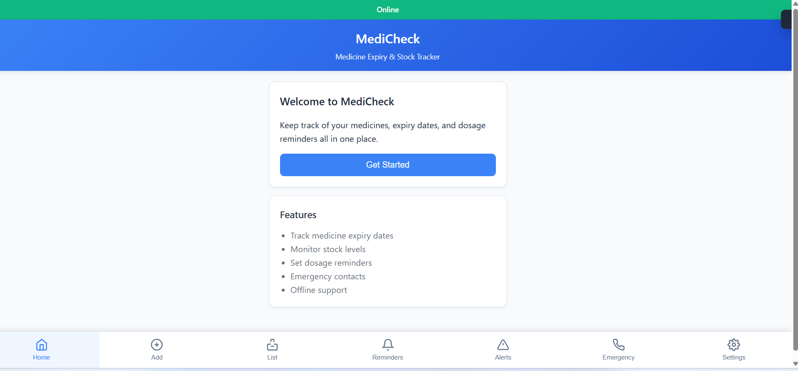

# MediCheck  
Medicine Expiry and Stock Tracker with Alerts and Offline Support  

---

## Project Overview  
MediCheck is an easy-to-use app that helps people and families keep track of their medicines.  
With this app, you can check expiry dates, see how much stock is left, set reminders for doses, and save emergency contacts in one place.  

The best part is that MediCheck also works without internet, so you can use it anytime, anywhere.  

---

## Key Features  
1. **Medicine Expiry Tracking**  
   - Records the expiry date of each medicine.  
   - Provides alerts before medicines expire to prevent unsafe usage.  

2. **Stock Monitoring**  
   - Tracks the quantity of medicines in stock.  
   - Generates alerts when stock reaches a low threshold.  

3. **Dosage Reminders**  
   - Allows users to schedule dosage times for each medicine.  
   - Sends reminders so that users never miss a dose.  

4. **Emergency Contacts**  
   - Stores important emergency contact information.  
   - Provides quick access in urgent situations.  

5. **Offline Support**  
   - Functions without the need for internet connectivity.  
   - Ensures uninterrupted access to medicine data and reminders.  

6. **User-Friendly Interface**  
   - Simple and clean design for easy navigation.  
   - Intuitive features suitable for users of all age groups.  

---

## Screenshots  
### Home Screen  
  
*(Insert the screenshot here once added to your GitHub repository)*  

The home screen provides an overview of the application. Users can access medicine tracking, reminders, stock levels, and emergency information directly from the main dashboard.  

---

## Technology Stack  
- **Frontend:** HTML, CSS, JavaScript  
- **Backend and Logic:** Java with JDBC  
- **Database:** MySQL or MongoDB for data management  
- **Environment:** Works offline, compatible with Windows environment  

---

## Future Plans ##

-Mobile app (Android/iOS).
-Online backup to use on many devices.
-Add medicine by scanning barcode.
-Show reports and history.
-Add more languages.

---

## Author##

Rohan Chandekar
- GitHub: [rohanchandekar09](https://github.com/rohanchandekar09)  
- Email: [rohanchandekar09@gmail.com](mailto:rohanchandekar09@gmail.com)  
